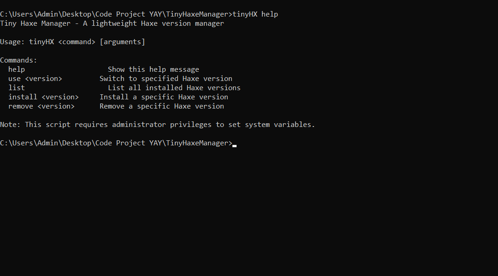

This is a AI project, i ask AI to do this but since pissed about change Haxe version so yea why not :)))

anyways, back to overview

# Tiny Haxe Manager
Tiny Haxe Manager is a tiny tool help you easily switch the Haxe version from 4.2.5 to 4.3.2, 4.3.2 to 4.3.6 and can be use like normal :D

# Feature
* Lightweight changing version: for real, the project is actually really small!
* Simple as hell command: the command is so EASY to USE dude
* Cool ass help menu: when use `tinyHX help`, is will back like: 

# Usage
See 

After use `tinyHX install` and `tinyHX use`, please restart your terminal to let the terminal know the Paths Variables ;_;
