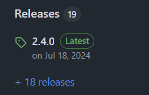

# Fix Neko DLL Issue

If you encounter issues installing `haxelib` because Neko is not working, this guide will help you resolve the problem.

1. Visit the [Neko GitHub page](https://github.com/HaxeFoundation/neko):  
   

2. Navigate to the "Releases" tab:  
   

3. Choose the version you want to download. It is highly recommended to use the latest version:  
     
   - For 64-bit computers, download `neko-<version>-win64.zip`.  
   - For 32-bit computers, download `neko-<version>-win.zip`.

4. Extract the downloaded file to a directory of your choice. For example, you can extract it to:  
   

5. Open the "View advanced system settings" window:  
   

6. Click on "Environment Variables":  
   

7. Under "User variables for Admin", select the `Path` variable and click "Edit":  
      
    - Add the path to the directory where you extracted Neko. For example: `C:\path\to\neko`.

8. Restart your terminal and try again. :D