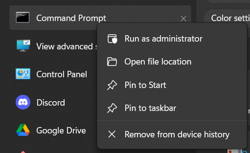
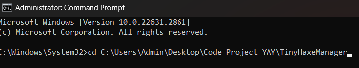
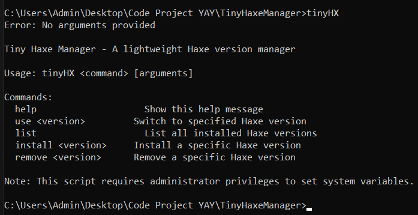

## How to Use TinyHX

This guide explains how to use TinyHX.

After do all of these step, follow 

### Steps to Follow:
1. Open the Start menu, search for the Command Prompt, and run it as an administrator:  
   

2. Use the `cd` command to navigate to the directory where TinyHX is located. For example:  
   

3. Once in the correct directory, you can start using TinyHX. Follow the on-screen instructions:  
   
